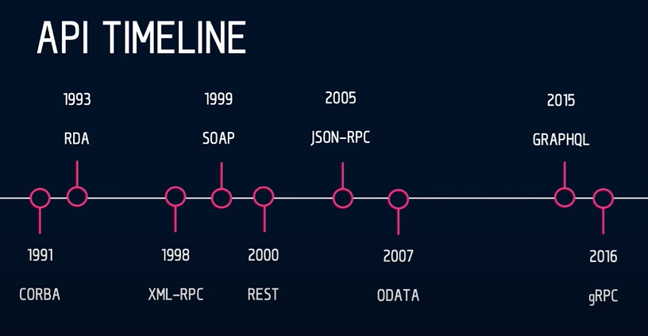
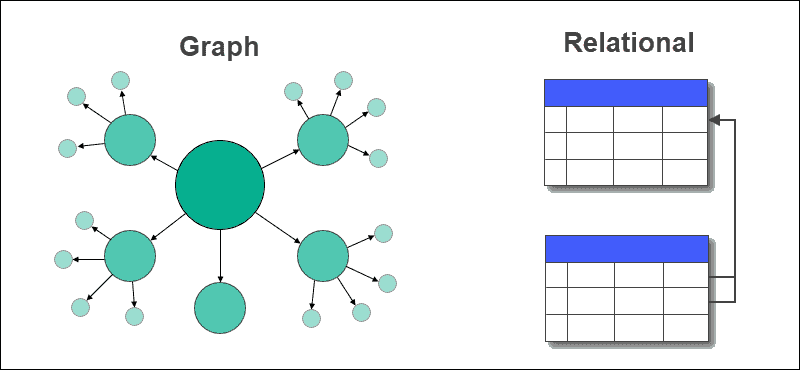
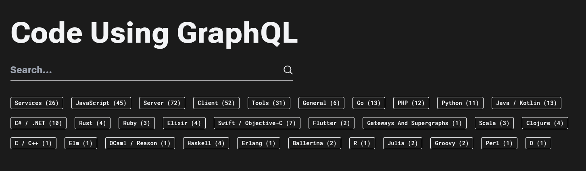

GraphQL и не только

------

Полезные ссылки

- [Doc graphql](https://graphql.org/learn/)
- [Sandbox graphiql](https://lucasconstantino.github.io/graphiql-online/)
- [Протоколы](https://htmlacademy.ru/blog/soft/protocol)
- [Что такое GraphQL](https://habr.com/ru/articles/765064/)
- [Что такое GraphQL](https://ru.hexlet.io/blog/posts/chto-takoe-graphql-s-osnov-do-pervyh-zaprosov#shema)
- [Что такое графовая база данных](https://wiki.merionet.ru/articles/chto-takoe-grafovaya-baza-dannyh)

------

Немного о протоколах

------

- IP - Internet Protocol отвечает за поиск компьютеров в сети по их IP-адресам. Ещё он предоставляет стратегию маршрутизации, то есть составляет оптимальный маршрут для передачи данных

------

- DNS - связывает IP-адрес с понятным для людей доменным именем, например, 172.217.16.132 = google.com

------

- SSL/TLS - SSL — криптографический протокол шифрования запросов и ответов, он нужен для безопасного перемещения данных по интернету, а TLS — его продвинутая версия. SSL уже почти не используют, но это название было таким популярным, что его до сих пор употребляют, а любой SSL-сертификат у хостинг-компаний — TLS-сертификат

------

- TCP и UDP - оба протокола отвечают за передачу данных и работают поверх IP, но с небольшой разницей. TCP доставляет данные без потерь, поэтому его используют для передачи фотографий, сообщений и другой важной информации. А вот UDP не гарантирует доставку, но зато он гораздо быстрее. Его используют, когда скорость важнее надёжности, например, при передаче аудиосообщений или видеотрансляциях

------

- HTTP и HTTPS - предназначены для передачи данных и в итоге пользователи могут просматривать веб-страницы. На самом деле HTTPS — это не отдельный протокол, а расширение HTTP. Он безопаснее, так как использует SSL/TLS для шифрования обычных запросов и ответов

------

- HTTP/2 - улучшенная версия HTTP. Главное нововведение этого протокола — одно TCP-соединение на разные запросы, или мультиплексирование

------

- HTTP/3 - основана на QUIC — протоколе, который предполагает быстрое подключение к интернету через UDP, поэтому скорость доставки данных быстрее, чем у HTTP и HTTP/2 поверх TCP

------

- WebSocket - используют там, где важна скорость доставки данных, например, в чатах и мессенджерах, играх, онлайн-трансляциях

------

Немного об архитектурных стилях и парадигмах

------



------

#### XML-RPC (Remote Procedure Call)
протокол для удаленного вызова процедур, который использует XML для кодирования запросов и ответов и HTTP в качестве транспортного протокола

------

#### SOAP (Simple Object Access Protocol)
- XML-RPC на стеройдах <!-- .element: class="fragment" -->
- помимо HTTP использует другие протоколы <!-- .element: class="fragment" -->
- поддерживает сложные типы данных <!-- .element: class="fragment" -->
- строгая структура данных <!-- .element: class="fragment" -->
- поддерживает транзакции и надежность передачи данных, поэтому часто используется в банковской и "около-денежной" сфере <!-- .element: class="fragment" -->

------

#### REST API
архитектурный стиль, предложенный Роем Филдингом в его диссертации в 2000 году. Он используется для создания веб-служб, которые взаимодействуют с использованием стандартных HTTP методов

------

#### ODATA (Open Data Protocol)
стандартный протокол, который расширяет REST API, предоставляя дополнительные функции для работы с данными

------

- определяет набор правил и соглашений для создания RESTful API, что делает его более стандартизированным по сравнению с обычным REST API
- поддерживает сложные запросы с использованием URL-параметров <!-- .element: class="fragment" -->
  - фильтрация ($filter)
  - сортировка ($orderby)
  - пагинация ($top, $skip)
  - выбор полей ($select)

------

Примеры ODATA

```
GET /Products
GET /Products(1)
GET /Products?$filter=Price gt 100
GET /Products?$orderby=Name
GET /Products?$top=10&$skip=20
GET /Products?$select=Name,Price
```

------

GraphQL

------

язык запросов и серверная среда для API с открытым исходным кодом. Он появился в Facebook в 2012 году и был разработан для упрощения управления конечными точками для API на основе REST

В 2015 году код GraphQL стал открытым, и сейчас GraphQL используют Airbnb, GitHub, Pinterest, Shopify и многие другие компании

------

Боль, с которой столкнулись в Facebook

------

[//]: # (- в REST API клиенты часто получают либо слишком много данных, которые им не нужны, либо слишком мало, что вынуждает делать несколько запросов для получения необходимой информации. GraphQL позволяет клиентам запрашивать только те данные, которые им нужны, и получать их в одном запросе, что делает коммуникацию более эффективной)

[//]: # ()
[//]: # (------)

[//]: # ()
[//]: # (- в REST API каждый эндпойнт обычно соответствует определенному ресурсу, что может привести к проблемам с расширяемостью и поддержкой разных версий API. В GraphQL же существует единая конечная точка для всех запросов, и схема API определяется на стороне сервера. Это делает API более гибким и облегчает его развитие. Т.е. в GraphQL нет версионирования типа /v1/ и /v2/ как в REST)

[//]: # ()
[//]: # (------)

[//]: # ()
[//]: # (- также во многих REST API при работе со связанными данными возникает проблема "N+1 запросов", когда для получения связанных данных нужно делать дополнительные запросы к серверу. GraphQL позволяет выразить связи между данными и получать все необходимые данные в одном запросе)

[//]: # ()
[//]: # (------)

Например, на том же Фейсбуке есть много пользователей, и для каждого пользователя нам нужно получить список его последних постов

------

В классическом REST API, чтобы получить такие данные, пришлось бы сделать несколько запросов к серверу

------

один запрос к эндпойнту пользователей для получения списка пользователей и запрос к энпойнту постов, у которого мы запросим посты для всех найденных пользователей (либо по одному запросу для каждого нужного пользователя)

------

С использованием GraphQL эта проблема может быть решена более эффективно. Можно запросить список пользователей и, одновременно, указать, что для каждого пользователя нужно получить последние посты

------

Так бы выглядели url`ы для ЛК
```
POST https://newlk.letai.ru/graphql
POST https://newlk.letai.ru/v3
```

Получаем всех пользователей и 5 последних постов
```
query {
  users {
    id
    name
    posts(last: 5) {
      id
      text
      timestamp
    }
  }
}
```

------

GraphQL использует метод POST протокола HTTP, но так же может использовать GET, но он менее распространён из-за ограничений на длину URL

```
GET /graphql?query={users{id,name}}
```

------

backend описывает атомарные сущности и связи так, как это требует бизнес, а frontend строит кастомные запросы в зависимости от потребностей конкретного элемента

------

Почему он Graph?

------



------

Schema

------

Чтобы работать с GraphQL на сервере нужно развернуть схему GraphQL (Schema), где прописывается логика работы GraphQL API, типы и структура данных. Схема состоит из двух взаимосвязанных объектов: TypeDefs и Resolvers

------

TypeDefs

------

```
  type User {
    id: Int
    name: String
    age: Int
    posts: [Post]
  }

  type Post {
    id: Int
    text: String
    timestamp: Int
  }

#query - аналог GET в REST
  type Query {
    users(id: Int!): User!
    posts(id: Int!): Post!
  }

#аналог POST и PUT в REST
  type Mutation {
    incrementLike(fname: String!) : [User!]
  }

#клиент слушает изменения в БД в режиме реального времени. Под капотом подписки используют вебсокеты
  type Subscription {
    listenLikes : [User]
  }
```

------

Resolvers

------

После определения типов необходимо добавить их логику. Это нужно, чтобы сервер знал, как отвечать на запросы клиента. Эта задача решается с помощью Resolvers

Resolver или распознаватель — функция, которая возвращает данные для определённого поля. Resolver’ы возвращают данные того типа, который определён в схеме. Распознаватели могут быть асинхронными. С их помощью можно получать данные из REST API, базы данных или другого источника

------

Resolver может быть описан на любом ЯП, даже на PHP

------



------

Примеры
[graphiql](https://lucasconstantino.github.io/graphiql-online/)

------

Простой запрос
```
query {
  continents {
    code
    name
  }
}
```

------

Запрос с фильтрацией
```
query {
  continents(
    filter: {
      code: {
        eq: "EU"
      }
    }
  ) {
    code
    name
  }
}
```

------

Запрос с переменными
```
query(
  $code: String!
) {
  continents(
    filter: {
      code: {
        eq: $code
      }
    }
  ) {
    code
    name
  }
}
```

------

Фрагменты
```
fragment fields on Continent {
  code
  name
}

query(
  $code: String!
) {
  continents(
    filter: {
      code: {
        eq: $code
      }
    }
  ) {
    ...fields
  }
}
```

------

Значение переменной по умолчанию
```
fragment fields on Continent {
  code
  name
}

query(
  $code: String = "EU"
) {
  continents(
    filter: {
      code: {
        eq: $code
      }
    }
  ) {
    ...fields
  }
}
```

------

```
fragment fields on Continent {
  code
  name
}

#Alias
query(
  $code: String = "EU"
) {
  eu: continents(
    filter: {
      code: {
        eq: $code
      }
    }
  ) {
    ...fields
  }
  as: continents(
    filter: {
      code: {
        eq: "AS"
      }
    }
  ) {
    ...fields
  }
}
```

------

Говорят "хорошая практика" задавать нейминг для запроса
```
fragment fields on Continent {
  code
  name
}

query get_continents(
  $code: String!
) {
  eu: continents(
    filter: {
      code: {
        eq: $code
      }
    }
  ) {
    ...fields
  }
  as: continents(
    filter: {
      code: {
        eq: "AS"
      }
    }
  ) {
    ...fields
  }
}
```

------

Директивы для динамического формирования респонса
```
query continents(
  $includeCountries: Boolean = false 
) {
  continents {
    code
    name
  }
  countries @include(if: $includeCountries) {
    code
    name
  }
}

query continents(
  $includeCountries: Boolean = true 
) {
  continents {
    code
    name
  }
  countries @skip(if: $includeCountries) {
    code
    name
  }
}
```

------

Плюсы

------

- точные данные без избыточности
  - снижение нагрузки на сеть <!-- .element: class="fragment" -->
  - экономия трафика <!-- .element: class="fragment" -->
  - получение данных одним запросом из нескольких БД, API и т.д. <!-- .element: class="fragment" -->
- единый эндпоинт <!-- .element: class="fragment" -->
- динамические запросы без участия backend разработчика <!-- .element: class="fragment" -->
- строгая типизация <!-- .element: class="fragment" -->
- документация API на лету, интерфейс для доки graphiql <!-- .element: class="fragment" -->
- отсутствие версий, расширяемость <!-- .element: class="fragment" -->

------

Минусы

------

- высокий порог входа, как для разработчиков так и для devops
- большая нагрузка на сервер <!-- .element: class="fragment" -->
  - необходимо ограничивать глубину запросов, условно 4 колена <!-- .element: class="fragment" -->
  - необходимо ограничивать количество получаемых полей <!-- .element: class="fragment" -->
  - backend разработчику необходимо оптимизировать запросы <!-- .element: class="fragment" -->
- отсутствует кеширование, дорабатывается костылями и обвесами <!-- .element: class="fragment" -->

------

- подверженность атакам
  - при получении токена приложения хацкеры смогут получать большие объемы информации и ухудшать производительность сервера <!-- .element: class="fragment" -->
  - необходимо контролировать доступ к данным, что бы избежать утечек <!-- .element: class="fragment" -->

------

Итог

------

GraphQL предоставляет мощные возможности для создания гибких и эффективных API, но требует тщательного подхода к проектированию, безопасности и оптимизации. Выбор между GraphQL и REST должен основываться на специфических потребностях проекта, уровне компетенции команды и архитектурных предпочтениях